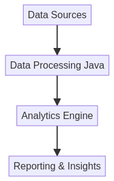

# Java-Analytics-Engine


## 🇧🇷 Português

### 🖼️ Imagem Hero



### Descrição do Projeto

Este projeto é um **Business Analytics and Reporting Engine** desenvolvido em Java com Spring Boot. Ele oferece funcionalidades robustas para análise de dados de negócios e geração de relatórios, permitindo insights aprofundados e tomadas de decisão estratégicas. Ideal para empresas que buscam otimizar seus processos de análise e obter uma visão clara de seu desempenho.

### Funcionalidades Principais

*   **Coleta e Processamento de Dados:** Integração com diversas fontes de dados e processamento eficiente.
*   **Análise de Negócios:** Ferramentas avançadas para análise de tendências, desempenho e métricas chave.
*   **Geração de Relatórios:** Criação de relatórios personalizados e dashboards interativos.
*   **Escalabilidade:** Arquitetura robusta e escalável para lidar com grandes volumes de dados.

### Tecnologias Utilizadas

*   **Linguagem:** Java
*   **Framework:** Spring Boot
*   **Gerenciamento de Dependências:** Apache Maven

### Como Executar

Para executar o projeto localmente, siga os passos abaixo:

1.  **Clone o repositório:**
    ```bash
    git clone https://github.com/galafis/Java-Analytics-Engine.git
    cd Java-Analytics-Engine
    ```
2.  **Compile e execute a aplicação:**
    ```bash
    mvn clean install
    mvn spring-boot:run
    ```

### Autor

Gabriel Demetrios Lafis

## 🇬🇧 English

### 🖼️ Hero Image


### Project Description

This project is a **Business Analytics and Reporting Engine** developed in Java with Spring Boot. It offers robust functionalities for business data analysis and report generation, enabling deep insights and strategic decision-making. Ideal for companies looking to optimize their analysis processes and gain a clear view of their performance.

### Key Features

*   **Data Collection and Processing:** Integration with various data sources and efficient processing.
*   **Business Analysis:** Advanced tools for analyzing trends, performance, and key metrics.
*   **Report Generation:** Creation of custom reports and interactive dashboards.
*   **Scalability:** Robust and scalable architecture to handle large volumes of data.

### Technologies Used

*   **Language:** Java
*   **Framework:** Spring Boot
*   **Dependency Management:** Apache Maven

### How to Run

To run the project locally, follow these steps:

1.  **Clone the repository:**
    ```bash
    git clone https://github.com/galafis/Java-Analytics-Engine.git
    cd Java-Analytics-Engine
    ```
2.  **Compile and run the application:**
    ```bash
    mvn clean install
    mvn spring-boot:run
    ```

### Author

Gabriel Demetrios Lafis

