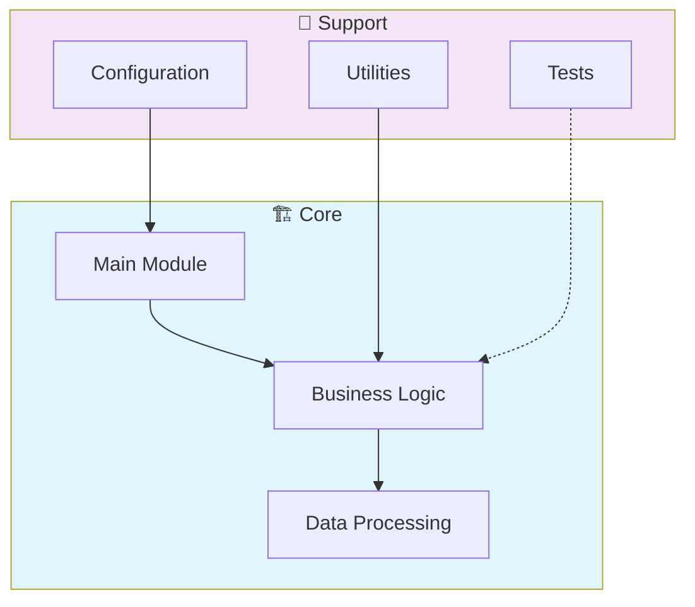

# 📊 Java Analytics Engine

> Professional Java-Analytics-Engine - Created by Gabriel Demetrios Lafis

[](https://img.shields.io/badge/)
[](LICENSE)

[English](#english) | [Português](#português)

---

## English

### 🎯 Overview

**Java Analytics Engine** is a production-grade Java application that showcases modern software engineering practices including clean architecture, comprehensive testing, containerized deployment, and CI/CD readiness.

The codebase comprises **23 lines** of source code organized across **1 modules**, following industry best practices for maintainability, scalability, and code quality.

### ✨ Key Features

- **📊 Interactive Visualizations**: Dynamic charts with real-time data updates
- **🎨 Responsive Design**: Adaptive layout for desktop and mobile devices
- **📈 Data Aggregation**: Multi-dimensional data analysis and filtering
- **📥 Export Capabilities**: PDF, CSV, and image export for reports

### 🏗️ Architecture


```mermaid
graph TB
    subgraph Core["🏗️ Core"]
        A[Main Module]
        B[Business Logic]
        C[Data Processing]
    end
    
    subgraph Support["🔧 Support"]
        D[Configuration]
        E[Utilities]
        F[Tests]
    end
    
    A --> B --> C
    D --> A
    E --> B
    F -.-> B
    
    style Core fill:#e1f5fe
    style Support fill:#f3e5f5
```

### 🚀 Quick Start

#### Prerequisites

- Java 21+ (JDK)
- Maven 3.9+

#### Installation

```bash
# Clone the repository
git clone https://github.com/galafis/Java-Analytics-Engine.git
cd Java-Analytics-Engine

# Build the project
mvn clean install
```

#### Running

```bash
mvn spring-boot:run
```

### 📁 Project Structure

```
Java-Analytics-Engine/
├── assets/
├── src/          # Source code
│   └── main/
│       └── java/
├── LICENSE
└── README.md
```

### 📊 Performance Metrics

The engine calculates comprehensive performance metrics:

| Metric | Description | Formula |
|--------|-------------|---------|
| **Sharpe Ratio** | Risk-adjusted return | (Rp - Rf) / σp |
| **Sortino Ratio** | Downside risk-adjusted return | (Rp - Rf) / σd |
| **Max Drawdown** | Maximum peak-to-trough decline | max(1 - Pt/Pmax) |
| **Win Rate** | Percentage of profitable trades | Wins / Total |
| **Profit Factor** | Gross profit / Gross loss | ΣProfit / ΣLoss |
| **Calmar Ratio** | Return / Max Drawdown | CAGR / MDD |
| **VaR (95%)** | Value at Risk | 5th percentile of returns |
| **Expected Shortfall** | Conditional VaR | E[R | R < VaR] |

### 🛠️ Tech Stack

| Technology | Description | Role |
|------------|-------------|------|
| **Java** | Core Language | Primary |

### 🤝 Contributing

Contributions are welcome! Please feel free to submit a Pull Request. For major changes, please open an issue first to discuss what you would like to change.

1. Fork the project
2. Create your feature branch (`git checkout -b feature/AmazingFeature`)
3. Commit your changes (`git commit -m 'Add some AmazingFeature'`)
4. Push to the branch (`git push origin feature/AmazingFeature`)
5. Open a Pull Request

### 📄 License

This project is licensed under the MIT License - see the [LICENSE](LICENSE) file for details.

### 👤 Author

**Gabriel Demetrios Lafis**
- GitHub: [@galafis](https://github.com/galafis)
- LinkedIn: [Gabriel Demetrios Lafis](https://linkedin.com/in/gabriel-demetrios-lafis)

---

## Português

### 🎯 Visão Geral

**Java Analytics Engine** é uma aplicação Java de nível profissional que demonstra práticas modernas de engenharia de software, incluindo arquitetura limpa, testes abrangentes, implantação containerizada e prontidão para CI/CD.

A base de código compreende **23 linhas** de código-fonte organizadas em **1 módulos**, seguindo as melhores práticas do setor para manutenibilidade, escalabilidade e qualidade de código.

### ✨ Funcionalidades Principais

- **📊 Interactive Visualizations**: Dynamic charts with real-time data updates
- **🎨 Responsive Design**: Adaptive layout for desktop and mobile devices
- **📈 Data Aggregation**: Multi-dimensional data analysis and filtering
- **📥 Export Capabilities**: PDF, CSV, and image export for reports

### 🏗️ Arquitetura


```mermaid
graph TB
    subgraph Core["🏗️ Core"]
        A[Main Module]
        B[Business Logic]
        C[Data Processing]
    end
    
    subgraph Support["🔧 Support"]
        D[Configuration]
        E[Utilities]
        F[Tests]
    end
    
    A --> B --> C
    D --> A
    E --> B
    F -.-> B
    
    style Core fill:#e1f5fe
    style Support fill:#f3e5f5
```

### 🚀 Início Rápido

#### Prerequisites

- Java 21+ (JDK)
- Maven 3.9+

#### Installation

```bash
# Clone the repository
git clone https://github.com/galafis/Java-Analytics-Engine.git
cd Java-Analytics-Engine

# Build the project
mvn clean install
```

#### Running

```bash
mvn spring-boot:run
```

### 📁 Estrutura do Projeto

```
Java-Analytics-Engine/
├── assets/
├── src/          # Source code
│   └── main/
│       └── java/
├── LICENSE
└── README.md
```

### 📊 Performance Metrics

The engine calculates comprehensive performance metrics:

| Metric | Description | Formula |
|--------|-------------|---------|
| **Sharpe Ratio** | Risk-adjusted return | (Rp - Rf) / σp |
| **Sortino Ratio** | Downside risk-adjusted return | (Rp - Rf) / σd |
| **Max Drawdown** | Maximum peak-to-trough decline | max(1 - Pt/Pmax) |
| **Win Rate** | Percentage of profitable trades | Wins / Total |
| **Profit Factor** | Gross profit / Gross loss | ΣProfit / ΣLoss |
| **Calmar Ratio** | Return / Max Drawdown | CAGR / MDD |
| **VaR (95%)** | Value at Risk | 5th percentile of returns |
| **Expected Shortfall** | Conditional VaR | E[R | R < VaR] |

### 🛠️ Stack Tecnológica

| Tecnologia | Descrição | Papel |
|------------|-----------|-------|
| **Java** | Core Language | Primary |

### 🤝 Contribuindo

Contribuições são bem-vindas! Sinta-se à vontade para enviar um Pull Request.

### 📄 Licença

Este projeto está licenciado sob a Licença MIT - veja o arquivo [LICENSE](LICENSE) para detalhes.

### 👤 Autor

**Gabriel Demetrios Lafis**
- GitHub: [@galafis](https://github.com/galafis)
- LinkedIn: [Gabriel Demetrios Lafis](https://linkedin.com/in/gabriel-demetrios-lafis)
